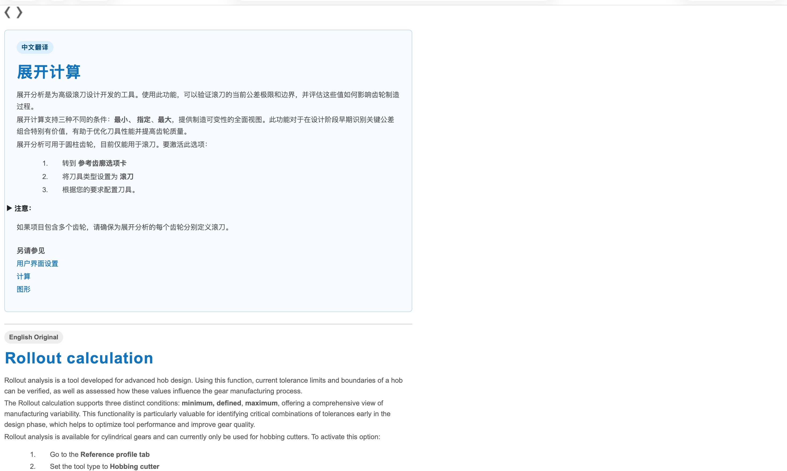

# KISSsoft 2025 中英双语帮助文档 (Help-ZH)

本项目为 **KISSsoft 2025 官方帮助文档（Help）的完整中英双语汉化版本**。

采用**中文在上、英文在下**的双语段落对照排版，既保证了中文阅读的流畅与高效，又完整保留了英文原版严谨的技术定义。所有原版公式、表格、结构及插图资源均 100% 完整保留，直接替换官方路径即可无缝生效。

---

## 📸 排版效果预览

文档采用精准段落级中英对照排版，中文高亮清晰，英文完整附后：



---

## 📊 翻译工程量统计

本项目对 KISSsoft 2025 的全量帮助系统进行了系统级汉化与核查：

| 统计维度 | 数量 / 规模 | 说明 |
| :--- | :--- | :--- |
| **HTML 页面总数** | **1,608 页** | 1,601 篇核心技术内容页 + 7 篇框架/导航页 |
| **中文字符总量** | **350,000+ 字** | 覆盖全部计算理论、输入参数说明与结果解读 |
| **英文单词总量** | **483,000+ 词** | 全量原版保留对照 |
| **图片与图表资源** | **1,000+ 张** | 示意图、流程图、公式图表与界面指南完全对齐 |
| **覆盖专业模块** | **100% 全覆盖** | 圆柱齿轮、锥齿轮、蜗杆、轴与轴承、轴系拓扑、弹簧等 |

---

## 🚀 使用方法

### 方式一：手动下载复制替换（推荐）

1. 点击本仓库右上角 **`Code` -> `Download ZIP`** 并解压。
2. 打开 KISSsoft 2025 安装目录下的 `help` 文件夹：
   ```text
   C:\Program Files\KISSsoft AG\KISSsoft 2025\help\
   ```
3. 将原来的 `e` 文件夹重命名为 `e_backup` 进行备份。
4. 将解压出来的 `e` 文件夹直接复制到该目录下替换。
5. 打开 KISSsoft 软件按 `F1` 键，即可立即调出完整的中英双语帮助文档。

---

### 方式二：Windows PowerShell 一键替换指令

在 Windows 电脑上打开 **PowerShell**（按下 `Win + R` 输入 `powershell` 回车），直接粘贴并执行以下单行命令即可自动完成备份与极速替换（无需安装 Git）：

```powershell
$h="C:\Program Files\KISSsoft AG\KISSsoft 2025\help"; if(Test-Path "$h\e"){ if(!(Test-Path "$h\e_backup")){ Rename-Item "$h\e" "$h\e_backup" } }; $z="$env:TEMP\k.zip"; Invoke-WebRequest "https://github.com/excellent-max/KISSsoft-2025-Help-ZH/archive/refs/heads/main.zip" -OutFile $z; Expand-Archive $z -DestinationPath "$env:TEMP\k" -Force; Copy-Item -Recurse -Force "$env:TEMP\k\KISSsoft-2025-Help-ZH-main\e" "$h\"; Remove-Item -Recurse -Force $z, "$env:TEMP\k"; Write-Host "✅ 汉化替换成功！打开 KISSsoft 按 F1 即可生效。" -ForegroundColor Cyan
```

---

## 💬 参与反馈与 Issue

KISSsoft 涉及极其庞杂的机械设计分支与专业学科算法。

由于主包精力有限，并非精通所有子学科模块，**部分模块专业词汇可能存在漏翻、生硬或不够精确的情况**。

非常欢迎各位机械工程师、齿轮与传动行业的前辈及同行共同完善：
- 发现错译、漏译或语病？👉 欢迎直接 [提交 Issue](https://github.com/excellent-max/KISSsoft-2025-Help-ZH/issues) 反馈（建议附上页面文件名或截图）。
- 有更好的专业术语建议？👉 欢迎提交 PR 或在 Issue 中指正，我们会及时核对并更新！

---

## 📌 后续计划

- [x] **KISSsoft 2025 Help 帮助文档中英双语汉化**（全量 1608 页已完成并上线）
- [ ] **KISSsoft 官方全套教程文档（Tutorials）汉化**（规划制作中）
  - 涵盖 Tutorial 001 ~ 021 等全套官方工程案例（包含螺栓分析、轴系拓扑建模、行星齿轮优化、差速器设计等 PDF 教程的中文版制作与排版整理）。

---

## 📄 免责声明

本汉化项目属于非官方的社区技术支持与翻译整理工作，仅供个人学习、工程研究与科研交流使用。KISSsoft 软件本体及其所有原始文档、商标及技术资料版权均归 **KISSsoft AG (Gleason Company)** 所有。
